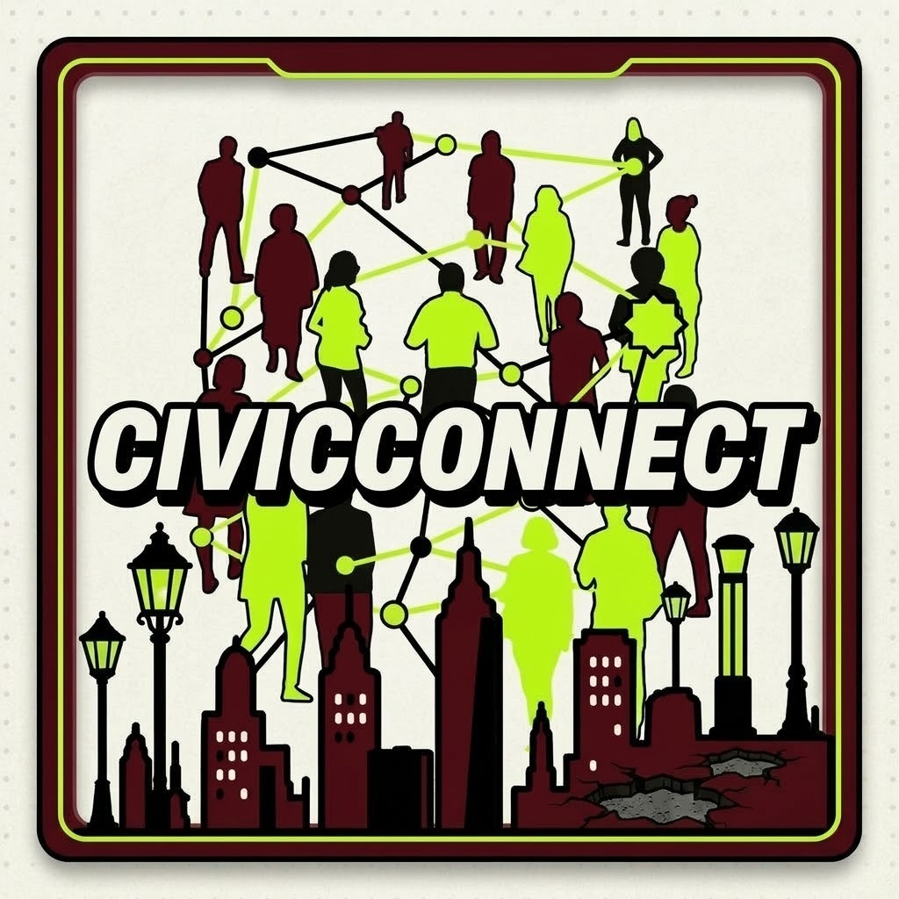
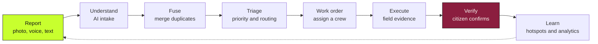
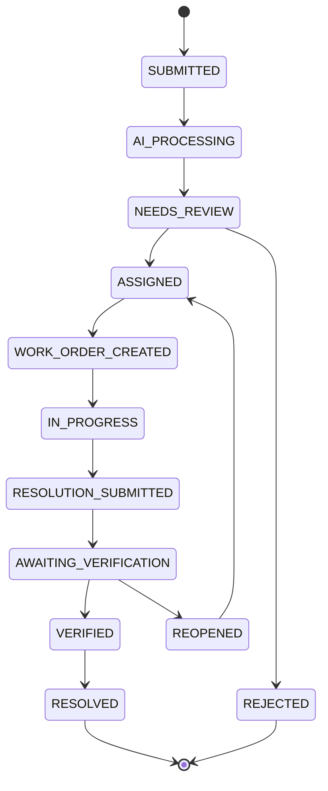
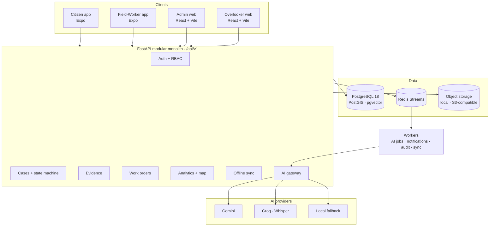

<div align="center">



# CivicConnect

### From a citizen's photo to a verified fix, on one civic case.

**A multilingual, AI-assisted civic issue platform that turns scattered complaints into one accountable case, from report to resolution.**

[](#)
[](#)
[](#)


[Links](#project-links) · [Run locally](#run-locally) · [Results](#headline-engineering-results) · [Problem](#the-problem) · [Solution](#the-solution) · [How it works](#how-it-works) · [AI](#ai-that-recommends-people-decide) · [Architecture](#architecture) · [Prototype](#prototype) · [Research](#research-and-references)

</div>

---

<!--
  HERO IMAGE: replace the placeholder below with a wide banner or a 3-device mockup
  (citizen phone + admin dashboard + field-worker phone).
  Save as docs/assets/hero.png and change the src.
-->
<p align="center">
  
</p>

---

**Crowdsourced Civic Issue Reporting & Resolution System**

**Hacksphere 2026, Web Development track** · Theme: Clean and Green Technology · Team "Game Of Codes"
Tanuj (team lead; backend, database, AI, integration), Krrish (lead frontend developer), Vedant (frontend), Parth (frontend, presentations)

CivicConnect lets a citizen report a pothole, a garbage heap or a broken streetlight by photo, voice or text in their own language, and follows it until the same citizen confirms it is fixed. Every report becomes part of one **Civic Case**; duplicates are merged, AI recommends and a person decides, a field worker proves the work with timestamped evidence, and the case closes only on the reporter's confirmation.

India's civic systems collect complaints at scale but lose them to translation gaps, duplication and false closure. Potholes alone were linked to 9,438 road deaths between 2020 and 2024 [[1]](#research-and-references), and Mumbai's average time to resolve a complaint rose from 30 to 48 days while complaint volume fell [[3]](#research-and-references). The gap is closure, not reporting. CivicConnect moves the work from "receive the complaint" to "prove the fix".

---

## Project links

| What | Link |
|---|---|
| Source code | https://github.com/tanujb03/CivicConnect_v2 |
| Admin web app | _to be added_ |
| Overlooker web app | _to be added_ |
| Android app (APK, direct install) | _to be added_ |
| API documentation (when running) | http://localhost:8000/docs |
| Demo video | _to be added_ |
| System design | [`docs/CivicConnect_v2_V1_System_Design.md`](docs/CivicConnect_v2_V1_System_Design.md) |

**Demo logins** are listed under [Run locally](#run-locally); every demo account is synthetic and shares one demo-only password.

---

## At a glance

| | |
|---|---|
| **4 apps** | Citizen and Field-Worker mobile apps (Expo), Admin and Overlooker web apps (React) |
| **42-endpoint frozen contract, 78 REST operations** | One versioned `/api/v1` API with generated OpenAPI documentation |
| **6 AI capabilities** | Intake, duplicate fusion, triage, resolution check, analytics explanation, grounded copilot |
| **4 input languages** | English, Hindi, Marathi and Hinglish, by text or by voice |
| **12-state case lifecycle** | Report, triage, work order, evidence, citizen verification, resolution |
| **1,000+ automated tests** | Workflow, authorization, evidence, sync, analytics and AI-gateway behaviour |
| **Synthetic demo city** | 10 wards, 8 departments, 560 cases, ready to explore after one command |

---
## Run locally

One compose file starts the database, Redis and the API, applies the migrations and serves the interactive documentation.

### Prerequisites

| | Version | Notes |
|---|---|---|
| **Docker** | Docker Desktop / Engine with Compose v2 | Runs PostgreSQL 18.6 + PostGIS 3.6 + pgvector 0.8.6, Redis 7.4 and the backend |
| **Node.js** | 20+ | For the two web apps and the two Expo apps |
| **Python** | 3.13 (3.11+ supported) | Only needed to run the tests or the backend outside Docker |
| **AI keys** | optional | `GEMINI_API_KEY` and `GROQ_API_KEY` in your gitignored `.env` switch on AI intake, triage and voice; without them the platform runs with manual intake and rule-based triage |

Copy [`.env.example`](.env.example) to `.env` first. Secrets live only in `.env`, which is gitignored.

### 1. Start the backend

```bash
docker compose --env-file .env -f infra/compose/docker-compose.yml up -d --build --wait
docker compose -f infra/compose/docker-compose.yml exec backend python -m backend.scripts.seed_demo
```

| Service | URL / port |
|---|---|
| API and interactive docs | http://localhost:8000/docs |
| Health | http://localhost:8000/api/v1/health/ready |
| PostgreSQL | `localhost:5434`, database `civicconnect` |
| Redis | `localhost:6380` |

The seed creates 8 departments, 10 wards, **560 synthetic cases** and the demo accounts below. Optional compose profiles: `s3` (S3-compatible storage), `scan` (antivirus daemon), `obs` (trace viewer). Stop with `docker compose -f infra/compose/docker-compose.yml down` (add `-v` to drop the data).

### 2. Sign in with a demo account

All demo accounts use the password `civicconnect-demo`.

| Role | Login |
|---|---|
| City admin | `admin@demo.civicconnect.test` |
| Department operator | `operator.road_maintenance@demo.civicconnect.test` |
| Department manager | `manager.road_maintenance@demo.civicconnect.test` |
| Field worker | `worker.road_maintenance@demo.civicconnect.test` |
| Ward officer | `ward01@demo.civicconnect.test` |
| Overlooker | `overlooker@demo.civicconnect.test` |
| Citizen | `citizen001@demo.civicconnect.test` |

### 3. Run the apps

```bash
# Admin or Overlooker (web)
cd apps/admin            # or apps/overlooker
npm install
VITE_API_BASE_URL=http://localhost:8000/api/v1 npm run dev

# Citizen or Field-Worker (mobile)
cd apps/citizen-expo     # or apps/field-worker-expo
npm install
EXPO_PUBLIC_API_URL=http://<your-LAN-IP>:8000/api/v1 npx expo start
```

A phone needs an address it can reach: your LAN IP, or a Cloudflare Tunnel ([`docs/infra/TUNNEL.md`](docs/infra/TUNNEL.md)); set `PUBLIC_BASE_URL` to match so signed media links work on the device.

### Running the API without Docker

```bash
# database and Redis only
.\scripts\dev\db_up.ps1                                   # Windows; or start any PostGIS 18 + pgvector and Redis 7
pip install -r backend/requirements.txt
python -m alembic upgrade head
python -m backend.scripts.seed_demo
python -m uvicorn backend.main:app --reload
```

### Run the tests

```bash
python -m pytest ai backend -q
```

---

## Headline engineering results

Everything below was measured by code in this repository on a laptop-class machine. Full detail: [`docs/CivicConnect_v2_V1_System_Design.md`](docs/CivicConnect_v2_V1_System_Design.md) (Appendix A) and [`docs/V1_CHANGE_LOG.md`](docs/V1_CHANGE_LOG.md).

| Check | Result |
|---|---|
| API surface | **42-endpoint frozen contract** plus extensions: 78 REST operations under `/api/v1`, OpenAPI committed and checked by a test |
| Automated tests | **1,621 passed, 5 skipped, 0 failed** (backend and AI, full run with PostgreSQL and Redis, 2026-10-09) |
| Database | PostgreSQL 18.6, PostGIS 3.6, pgvector 0.8.6 from one image; 4 migrations, one head, no schema drift |
| Spatial and vector search | PostGIS radius queries; pgvector cosine search with HNSW indexes for 384- and 768-dimension embeddings |
| Event pipeline | Redis Streams workers verified against a real Redis container: events consumed, nothing left pending |
| Evidence flow | init, signed upload, complete with size, SHA-256 and magic-byte MIME checks, signed download: verified end to end |
| Object storage | Local signed URLs and an S3-compatible round trip against SeaweedFS |
| Stack from empty volumes | Compose stack healthy; idle memory about 150 MB for the core stack (about 1.2 GB with every optional profile) |
| Demo city | 8 departments, 10 wards, 560 synthetic cases, 7 demo roles |
| Languages | English, Hindi, Marathi and Hinglish input; 9 categories and 27 subcategories in the civic taxonomy |

**Scope, stated on purpose:** the demo city and the 336-row evaluation set (84 reports each in English, Hindi, Marathi and Hinglish, 27 labels) are synthetic or LLM-written. They are used to compare configurations and catch regressions, not to claim accuracy on real citizens.

---

## The problem

Cities do not lack complaint channels. They lack **closure**.

- Potholes were linked to **9,438 deaths and 23,056 accidents** in India between 2020 and 2024, and the yearly toll rose from 1,555 to 2,385 [[1]](#research-and-references). Some states reported zero for all five years, so the true count is higher [[1]](#research-and-references).
- India lost about **1.77 lakh lives on roads in 2024** [[2]](#research-and-references).
- Mumbai's complaint volume fell from 1.28 lakh (2019) to 90,250 (2021) while the **average days to resolve rose from 30 to 48** [[3]](#research-and-references).
- A single Mumbai monsoon produced **8,000+ pothole complaints through three separate channels** (portal, WhatsApp and X) [[4]](#research-and-references). Chennai runs a helpline, an app, WhatsApp, a grievance portal and social media pages side by side [[5]](#research-and-references).
- When the same problem is reported many times, the work multiplies: in New York's 311 data, **29% of inspected requests were duplicates** of a problem already reported [[6]](#research-and-references).
- On the central grievance portal (CPGRAMS), State and UT governments average **64 days** to dispose of a grievance [[16]](#additional-sources-cited-in-our-submission). Even the central ministries miss their own target: a **15-day average against a 21-day timeline**, with **5,845 cases older than 90 days** (January 2026) [[9]](#research-and-references).
- India's national sanitation app has logged **11,24,411 complaints since August 2016** and reports 93.3% resolved on paper [[17]](#additional-sources-cited-in-our-submission). Closure is by an official's photo, and nothing requires the citizen to confirm the fix [[7]](#research-and-references); user reviews describe complaints closed with unrelated photos.
- **98% of Indian internet users** (886 million in the 2024 survey [[22]](#additional-sources-cited-in-our-submission)) consume content in Indian languages, and 41% of the population is still offline [[8]](#research-and-references). India has 121 languages, 22 of them scheduled [[10]](#research-and-references), yet computer literacy is only **24.7% nationally and 18.1% in rural areas** [[18]](#additional-sources-cited-in-our-submission). Voice and local-language input are not conveniences; they are how most people can take part.
- India has **4,700+ urban local bodies** and over 10 lakh municipal functionaries [[19]](#additional-sources-cited-in-our-submission). A CAG audit found an average **37% vacancy rate** in the test-checked bodies [[20]](#additional-sources-cited-in-our-submission), and 78% of junior-engineer posts in Gurugram were vacant [[21]](#additional-sources-cited-in-our-submission). Even a correctly routed complaint waits for someone to work on it, so automation, smart routing and duplicate elimination matter.
- Field crews often get instructions by phone call or paper, with no standard digital work order and no timestamped proof of when work began or ended.

Reporting is the easy part. Merging duplicates, routing to the right department, proving the work was done and letting the citizen confirm it are the hard parts. That is what CivicConnect is built for.

None of the public platforms we reviewed combine all four of **multimodal intake** (text, voice, photo, GPS), **multilingual conversation**, **offline-first submission** and **case fusion with citizen verification**. CivicConnect is designed around that combination.

---
## The solution

CivicConnect replaces the "complaint" with a **Civic Case**.

> A citizen report is a *signal*. A Civic Case is the *municipal problem*. Many reports, photos, confirmations, field observations and official actions converge on one case that is tracked until the citizen confirms the fix.



### What makes it different

| Capability | What it means in practice |
|---|---|
| **One case, many voices** | Duplicate reports are merged into one case; neighbours add support instead of adding rows. |
| **Voice, photo or text, in your language** | Speak a complaint in Hindi, Marathi or English, or send a photo. The system structures it into category, severity and location. |
| **AI recommends, a person decides** | Every AI suggestion shows its reason and confidence. Staff accept, edit or reject, and every override is written to an audit log. |
| **Proof of work** | A field worker closes a work order with before-and-after evidence tied to the same case. |
| **The citizen closes the loop** | A case reaches *Resolved* only after the citizen answers *Yes, Partly, Still happening* or *No*. *Still happening* reopens it. |
| **City-level learning** | Ward heatmaps, recurring-problem detection, hotspots and incident boards turn closed cases into planning input. |
| **Built for weak networks** | An idempotent batch sync protocol means a retried submission never creates a second case. |

---
## The four apps

| App | Who it is for | Stack | Highlights |
|---|---|---|---|
| **Citizen** | Residents | Expo / React Native | Report by photo, voice or text; AI-assisted intake review; nearby cases; support a neighbour's report; verify the fix; notifications; city map. |
| **Field Worker** | Crews on the ground | Expo / React Native | Assigned work orders, start-work, before/after evidence capture, completion with checksum-verified uploads. |
| **Admin** | Department operators, managers, ward officers, city admins | React 18 + Vite | Priority queue, case workbench, AI triage panel, department coordination, performance, ward heatmap, analytics, incident boards, user management, system settings. |
| **Overlooker** | City leadership | React 18 + Vite | City intelligence home, city-wide issue view, analytics, community intelligence, situation analysis. |

---
## How it works

### From report to resolution, step by step

```
Capture  →  Understand  →  Fuse  →  Triage  →  Work order  →  Execute  →  Verify  →  Learn
```

1. **Capture.** The citizen records a voice note, photo and GPS location, in any combination. The report is stored on the phone first and sent when a connection is available; every queued mutation carries an idempotency key, so a retry never creates a second case.
2. **Understand.** Speech goes through Whisper, non-English text is translated into canonical English fields while the original is preserved, and the intake model proposes category, subcategory, severity and department as schema-validated JSON. The citizen confirms or edits it.
3. **Fuse.** A deterministic gate (same category, radius, time window) narrows the candidates; embedding similarity in pgvector ranks them. The citizen or an administrator decides whether to support the existing case or file a new one.
4. **Triage.** A configuration-driven priority score and an AI recommendation, with reasons, reach an operator who records the final decision. Overrides are audited.
5. **Work order.** The case becomes a work order with department, crew, deadline and required evidence.
6. **Execute.** The field worker starts the work (timestamped), uploads an after-photo and a note, and completes it.
7. **Verify.** The citizen answers *Yes, Partly, Still happening* or *No*. Only a confirmation resolves the case; *Still happening* reopens it.
8. **Learn.** Hotspots, recurring problems, department performance and ward comparisons update from the closed cases.

### One case, one lifecycle

The server owns the state. Every transition is recorded as an immutable event, and rejection, resolution, reopening and verification also write audit rows.



### Duplicate fusion in two stages

1. **Deterministic gate.** Only cases of the same category, within a radius and a time window, are candidates (PostGIS `ST_DWithin`).
2. **Semantic similarity.** Candidates are ranked by embedding similarity in **pgvector** (cosine distance, HNSW index). Above the duplicate threshold, the reports are offered as the same case; between the thresholds they are shown as related.

The thresholds are admin-adjustable at run time from the Settings page, with no redeploy.

### Priority is explainable

Priority is a configuration-driven score of seven components: severity, supporters, location sensitivity, case age, recurrence, SLA risk and incident context. AI can recommend a change; a person decides, and the reason is stored.

### Evidence you can trust

Uploads follow three steps (initialise, upload to a short-lived signed URL, complete with checksum), with size limits, extension checks and **magic-byte MIME sniffing**. Media lives in private object storage, never in the database.

---
## AI that recommends, people decide

AI sits behind a single `AIProvider` interface, so models are configuration, not code. Gemini is the primary provider, Groq is the fallback and powers Whisper speech-to-text, and a small local classifier is the last-resort fallback.

| # | Capability | What it does | Human control |
|---|---|---|---|
| **AI-1** | Multimodal intake | Turns text, photo and voice transcript into a structured proposal: category, subcategory, severity, location context. Output is schema-validated before use. | Citizen confirms or edits before submitting. |
| **AI-2** | Case fusion | Finds and explains likely duplicates and related cases. | Staff or citizen accept or decline a merge. |
| **AI-3** | Triage | Suggests priority, department and SLA class with reasons. | Operator accepts, edits or rejects; the override is audited. |
| **AI-4** | Resolution check | Compares before and after evidence. | Can never close a case; verification stays with the citizen and staff. |
| **AI-5** | Analytics explanation | Writes plain-language narratives from numbers already computed in SQL. | The AI writes sentences; it never produces a figure. |
| **AI-6** | Grounded copilot | Answers admin questions through tool calls over the same queries that power the dashboards. | Answers cite the data they used. |

**Voice reports** are transcribed with Whisper on Groq, and the detected language and transcript are stored on the evidence item.

**Aligned with India's AI Governance Guidelines (Nov 2025)** [[11]](#research-and-references):

| Principle | How CivicConnect answers it |
|---|---|
| People First | AI recommends, an authorised person decides. |
| Accountability | Append-only audit log; model, prompt and schema versions recorded with each AI result. |
| Understandable by Design | Reasons and confidence shown beside every recommendation. |
| Fairness and Equity | No citizen reputation score; protected attributes excluded from priority. |
| Safety and Resilience | Fallback providers and manual paths when an AI service is unavailable. |

---
## Architecture



### Backend modules

CivicConnect is a modular monolith of 14 modules:

| Module | Responsibility |
|---|---|
| Auth | Password login, rotating refresh tokens, role-scoped access |
| Users | Profiles, roles, permissions, deactivation |
| Cases | Civic Case lifecycle, state machine, timeline |
| Evidence | Upload initialisation, completion, checksums, signed URLs |
| Community | Support, contributors, evidence aggregation |
| Departments | Coverage, routing, performance |
| Work Orders | Assignment, start, completion, resolution evidence |
| Notifications | In-app notifications and workflow events |
| Incidents | Special boards, incident grouping, boundaries |
| Analytics | Aggregates, trends, hotspots, recurrence |
| AI | Intake, fusion, triage, resolution review, copilot |
| Search | Case ID, title, category, semantic and geospatial search |
| Geo | PostGIS nearby queries, ward containment, clustering |
| Audit | Append-only event log for every consequential action |

### Data model

14 core entities: **User, Ward, Department, CivicCase, ReportSignal, EvidenceItem, AIAnalysis, CaseRelation, Support, WorkOrder, Verification, Notification, Incident, AuditEvent**.

### AI pipeline

| Stage | Technology | Function |
|---|---|---|
| Intake | Gemini / Groq structured output | Text and image to category, subcategory, severity and department |
| Speech | Groq Whisper | Marathi, Hindi and English voice to text |
| Translation | LLM | Non-English intake to canonical English fields, plus a summary in the citizen's language; the original is always preserved |
| Fusion | Deterministic gate, then pgvector embeddings | Category, radius and time window first, then embedding similarity |
| Triage | LLM plus deterministic rules | Recommends severity, priority, department and SLA |
| Resolution | LLM | Evidence-consistency signal and a request for citizen verification |
| Analytics | SQL aggregates, then LLM | SQL provides the numbers; the LLM explains them without inventing data |

### Tech stack

| Layer | Technology |
|---|---|
| **Mobile apps** | Expo SDK 57, React Native 0.86, React 19, TypeScript, expo-router, expo-camera, expo-audio, expo-location, expo-sqlite |
| **Web apps** | React 18, Vite 5, TypeScript, Tailwind CSS, Radix UI, TanStack Query, Recharts, Leaflet |
| **Backend** | Python 3.13, FastAPI, Pydantic 2, SQLAlchemy 2.1, Alembic |
| **Database** | PostgreSQL 18.6, PostGIS 3.6 (geography, GiST), pgvector 0.8.6 (HNSW), full-text search |
| **Events** | Redis Streams with consumer groups |
| **AI** | Gemini (structured output, vision, embeddings), Groq (Whisper, fallback LLM), pluggable `AIProvider` |
| **Storage** | `ObjectStorage` abstraction: local signed URLs or any S3-compatible store |
| **Auth** | bcrypt, short-lived JWT access tokens, rotating refresh tokens with reuse detection, roles read from the database on every request |
| **Infrastructure** | Docker Compose (db, redis, backend; optional S3, antivirus and tracing profiles), Vercel for web apps, EAS for mobile |
## Security and privacy

- **Server-side authorization.** Roles come from the database, never from the client; object-level checks guard every case, evidence item and work order.
- **Idempotency keys** on mutations, cursor pagination and a uniform error envelope with request IDs.
- **Private evidence.** No public buckets; short-lived signed URLs; checksum on upload.
- **Immutable history.** Case events and audit events are append-only.
- **Data minimisation.** Minimal personal data, separation of identity from case content, and role-scoped views.
- Designed with the **OWASP API Security Top 10 (2023)** [[12]](#research-and-references) and **ASVS 5.0** [[13]](#research-and-references) as checklists, and **aligned with the DPDP Rules 2025** principles of purpose limitation and data minimisation [[14]](#research-and-references).
- Interfaces follow **WCAG 2.2** [[15]](#research-and-references) guidance: touch-friendly layouts, language and accessibility settings and reduced-motion support.
## API at a glance

| Area | Examples |
|---|---|
| Auth and profile | `POST /auth/register`, `/auth/login`, `/auth/refresh`, `GET /auth/me`, `PATCH /me` |
| Cases | `POST /cases`, `GET /cases`, `PATCH /cases/{id}`, `/support`, `/reopen`, `/timeline`, `/verification` |
| AI | `POST /cases/intake/analyze`, `/cases/{id}/fusion/analyze`, `/triage/analyze`, `/copilot/query` |
| Evidence | `POST /evidence/upload-init`, `/evidence/{id}/complete` |
| Work orders | `POST /cases/{id}/work-orders`, `/work-orders/{id}/start`, `/complete` |
| Map and analytics | `GET /map/cases`, `/map/hotspots`, `/analytics/overview`, `/analytics/trends`, `/analytics/wards` |
| Incidents | `POST /incidents`, `/incidents/{id}/cases` |
| Offline | `POST /sync/mutations`, `GET /sync/changes` |
| Administration | `GET/POST/PATCH /admin/users`, `GET/PUT /admin/settings`, `GET /reference/*` |
| Operations | `GET /health/live`, `/health/ready` |

Interactive documentation is served at `/docs` when the API is running, and the contract is committed as [`backend/openapi.json`](backend/openapi.json).
## Languages

English, Hindi, Marathi and Hinglish input, by text or voice. Case notifications are provided in English, Hindi and Marathi. The taxonomy covers **9 categories and 27 subcategories** across roads, water supply, sanitation, drainage and sewerage, street lighting, parks and trees, public health and traffic, each mapped to one of 8 departments.

---
## Deployment

| Part | How it runs |
|---|---|
| **Backend, database, Redis** | One Docker Compose stack (`infra/compose/docker-compose.yml`). The backend image is non-root, runs the migrations on start and reports readiness at `/api/v1/health/ready`. |
| **Admin and Overlooker** | Static builds on Vercel (`vercel.json` in each app). |
| **Citizen and Field Worker** | Expo apps, built as Android APKs with EAS (`eas.json`). |
| **Media** | Private object storage behind signed URLs: local volume by default, any S3-compatible store (SeaweedFS in the `s3` profile) for the cloud path. |
| **Phones reaching the stack** | LAN address or a Cloudflare Tunnel; `PUBLIC_BASE_URL` makes signed links resolve on the device. |
| **AI** | Gemini primary, Groq fallback and Whisper, local fallback classifier. Models are read from environment variables, never hard-coded. |

---

## Prototype

> Replace each placeholder by saving a screenshot at the path shown (`docs/prototype/…`) and changing the image URL to that path.
> Click any screenshot in the final version for full resolution.
> Suggested size: phone screens 390 × 844, desktop screens 1440 × 900.

**Citizen** (`apps/citizen-expo`): report by photo, voice or text, review the AI proposal, find nearby duplicates, track the case and verify the fix.

<table>
  <tr>
    <td align="center"><br/><sub><b>Welcome and sign in</b><br/><code>01-Citizen/01-login.png</code></sub></td>
    <td align="center"><br/><sub><b>Dashboard</b><br/><code>01-Citizen/02-dashboard.png</code></sub></td>
    <td align="center"><br/><sub><b>Report: photo, voice, text</b><br/><code>01-Citizen/03-report.png</code></sub></td>
    <td align="center"><br/><sub><b>AI intake review</b><br/><code>01-Citizen/04-ai-review.png</code></sub></td>
  </tr>
  <tr>
    <td align="center"><br/><sub><b>Nearby similar reports</b><br/><code>01-Citizen/05-duplicates.png</code></sub></td>
    <td align="center"><br/><sub><b>Case detail and timeline</b><br/><code>01-Citizen/06-case-detail.png</code></sub></td>
    <td align="center"><br/><sub><b>City map</b><br/><code>01-Citizen/07-map.png</code></sub></td>
    <td align="center"><br/><sub><b>Verify the fix</b><br/><code>01-Citizen/08-verify.png</code></sub></td>
  </tr>
</table>

**Field worker** (`apps/field-worker-expo`): receives the work order, starts work, captures before-and-after evidence and completes the job.

<table>
  <tr>
    <td align="center"><br/><sub><b>Assigned work</b><br/><code>02-Field-Worker/01-assigned.png</code></sub></td>
    <td align="center"><br/><sub><b>Work order detail</b><br/><code>02-Field-Worker/02-detail.png</code></sub></td>
    <td align="center"><br/><sub><b>Before / after evidence</b><br/><code>02-Field-Worker/03-evidence.png</code></sub></td>
    <td align="center"><br/><sub><b>Complete work</b><br/><code>02-Field-Worker/04-complete.png</code></sub></td>
  </tr>
</table>

**Admin** (`apps/admin`): case workbench, AI triage, work orders, department performance, ward heatmap and incident boards.

<table>
  <tr>
    <td align="center"><br/><sub><b>Operations dashboard</b><br/><code>03-Admin/01-dashboard.png</code></sub></td>
    <td align="center"><br/><sub><b>Case workbench</b><br/><code>03-Admin/02-workbench.png</code></sub></td>
  </tr>
  <tr>
    <td align="center"><br/><sub><b>AI triage panel</b><br/><code>03-Admin/03-triage.png</code></sub></td>
    <td align="center"><br/><sub><b>Ward heatmap</b><br/><code>03-Admin/04-heatmap.png</code></sub></td>
  </tr>
  <tr>
    <td align="center"><br/><sub><b>Incident board</b><br/><code>03-Admin/05-incident.png</code></sub></td>
    <td align="center"><br/><sub><b>Department performance</b><br/><code>03-Admin/06-performance.png</code></sub></td>
  </tr>
</table>

**Overlooker** (`apps/overlooker`): the city-wide view of issues, analytics and community intelligence.

<table>
  <tr>
    <td align="center"><br/><sub><b>City intelligence home</b><br/><code>04-Overlooker/01-home.png</code></sub></td>
    <td align="center"><br/><sub><b>City situation analysis</b><br/><code>04-Overlooker/02-situation.png</code></sub></td>
  </tr>
</table>

**Demo video**

<!-- Replace with your video link or an animated GIF: docs/assets/demo.gif -->
<p align="center">
  <a href="#"></a>
</p>

---
## Demo walkthrough

A twelve-scene story that follows one pothole from report to city learning.

| # | Scene | What happens |
|---|---|---|
| 1 | Identify the issue | A citizen notices a large pothole near a school. |
| 2 | Multimodal reporting | A voice note in Marathi, a photograph and the GPS location. |
| 3 | Offline submission | The network is off; the report is saved on the phone. |
| 4 | Automatic synchronisation | The network returns and the pending report syncs. |
| 5 | AI understanding | Category Road Damage, subcategory Pothole, severity High, department Road Maintenance. |
| 6 | Case fusion | A nearby existing case is found; the citizen chooses to support it. |
| 7 | Community evidence | The administrator sees the case now has several supporters. |
| 8 | Work order | The administrator creates and assigns a work order. |
| 9 | Field execution | The field worker starts the job and uploads an after-photo. |
| 10 | Resolution evidence | The resolution evidence is submitted. |
| 11 | Citizen verification | The citizen answers "Yes, fixed." |
| 12 | City intelligence | The Overlooker dashboard shows the ward hotspot easing. |

*Distances, similarity scores and supporter counts shown in the walkthrough are illustrative scenario values, not measured results.*

---
## Research and references

Every figure in this README carries a source. Status labels: **Primary** = official document or the official figure quoted by a news agency that names it; **Reported** = figure from a news report of an official or institutional source.

### The problem

| # | Claim | Source | Status |
|---|---|---|---|
| 1 | Pothole-related deaths rose from 1,555 (2020) to 2,385 (2024); 9,438 deaths and 23,056 accidents in five years; several states reported zero. Ministry of Road Transport and Highways reply in the Lok Sabha, 12 Feb 2026 | [Siasat / PTI](https://www.siasat.com/pothole-related-road-deaths-surge-53-in-5-yrs-9438-killed-nationwide-3348935/) | Primary (via agency) |
| 2 | 1,72,890 road deaths (2023) and 1,77,177 (2024) | [The Tribune](https://www.tribuneindia.com/news/punjab/potholes-claim-414-lives-in-state-in-five-yrs-743-across-north-india/) | Primary (via press) |
| 3 | Mumbai: complaints 1.28 lakh (2019) to 90,250 (2021); days to resolve 30, 39, 48. Praja Foundation analysis of BMC data | [Free Press Journal](https://www.pressreader.com/india/the-free-press-journal/20220506/281608129015828) | Reported |
| 4 | Mumbai: 8,032 pothole complaints in about ten weeks of the 2026 monsoon through the MyBMC portal, WhatsApp and X | [Outlook India](https://www.outlookindia.com/national/mumbai-records-8000-pothole-complaints-despite-rs-17000-crore-road-project) | Reported |
| 5 | Chennai's parallel grievance channels (1913 helpline, Namma Chennai app, WhatsApp, portal, social media) | [Greater Chennai Corporation on X](https://x.com/chennaicorp/status/1845640931070070852) | Primary |
| 6 | 140,057 inspected NYC 311 requests collapse to 98,994 unique incidents (29% duplicates); some neighbourhoods report incidents about 3x as fast. Liu, Bhandaram and Garg | [arXiv 2204.08620](https://arxiv.org/abs/2204.08620) | Primary (US data) |
| 7 | National sanitation app: closure by an official's photo, citizen can reopen | [Janaagraha](https://www.janaagraha.org/work/swachhata-technology-platform/), [App Store listing](https://apps.apple.com/in/app/swachhata-mohua/id1124033628) | Primary (builder-reported) |
| 8 | About 958 million internet users, 57% rural; 98% access content in Indian languages; 41% of the population offline | [BestMediaInfo (IAMAI-Kantar 2025)](https://bestmediainfo.com/insights/indias-internet-users-near-one-billion-in-2025-rural-india-leads-growth-iamai-11056899), [BusinessToday (IAMAI-Kantar 2024)](https://www.businesstoday.in/technology/news/story/indias-internet-revolution-key-insights-from-kantar-and-iamai-report-461043-2025-01-16) | Primary (via press) |
| 9 | Central grievance portal (CPGRAMS): 15-day average against a 21-day timeline, 5,845 cases older than 90 days (31 Jan 2026) | [PIB, 11 Feb 2026](https://www.pib.gov.in/PressReleasePage.aspx?PRID=2226247&reg=3&lang=1) | Primary |
| 10 | India has 121 languages, 22 of them scheduled (Census 2011 language data) | [Business Standard](https://www.business-standard.com/article/current-affairs/more-than-19-500-mother-tongues-are-spoken-in-india-says-report-118070100250_1.html) | Primary (via press) |

### Existing platforms reviewed

| Platform | Source |
|---|---|
| MyBMC MARG, Mumbai (launched April 2026; 114 categories, geo-tagged photos, real-time tracking) | [Mumbai Tribune](https://www.mumbaitribune.in/2026/04/23/bmc-launches-marg-system-to-streamline-civic-grievance-redressal-in-mumbai/), [Play Store](https://play.google.com/store/apps/details?id=com.esri.ugms_bmc&hl=en_IN) |
| Namma Chennai, Greater Chennai Corporation | [data.gov.in community page](https://community.data.gov.in/?p=109293), [The News Minute](https://www.thenewsminute.com/tamil-nadu/field-staff-discourage-us-filing-complaints-residents-flag-namma-chennai-app-135406) |
| Fix My Street, Bengaluru | [Deccan Herald](https://www.deccanherald.com/india/karnataka/bengaluru/fix-my-street-app-gets-around-25k-complaints-in-15-days-1182417.html) |
| Swachhata-MoHUA, national | [Janaagraha](https://www.janaagraha.org/work/swachhata-technology-platform/) |

Also reviewed from public descriptions: **CPGRAMS** (national scale), **Janaspandana** (Karnataka, 40+ departments), **Aaple Sarkar** (Maharashtra statewide one-stop platform) and **Sahaaya 2.0** (Bengaluru, multi-department).

In the public documentation we reviewed, none of these describes automatic merging of duplicate reports into one case, voice reporting in Indian languages, a rule that the citizen must confirm the fix before closure, or field work orders with before-and-after evidence tied to the same case. CivicConnect combines all four.

### Additional sources cited in our submission

| # | Claim | Source as cited |
|---|---|---|
| 16 | CPGRAMS average disposal time of 64 days for State/UT governments | DARPG, CPGRAMS monthly report, PIB (2025) |
| 17 | Swachhata-MoHUA: 11,24,411 complaints since August 2016, 10,48,560 resolved (93.3%) | Reply in Parliament (Sansad), 2026 |
| 18 | Computer literacy 24.7% nationally, 18.1% rural | NSS 78th Round (2024) |
| 19 | 4,700+ urban local bodies, 10 lakh+ municipal functionaries | Ministry of Housing and Urban Affairs / CBC (2026) |
| 20 | 37% average vacancy across test-checked urban local bodies | CAG performance audit on municipal staffing (2024) |
| 21 | 78% of junior-engineer posts vacant in Gurugram | The Tribune (2026) |
| 22 | 886 million internet users, 98% accessing Indic-language content | IAMAI / Kantar, Internet in India 2024 |


### Policy, law and standards

| # | Standard | Source |
|---|---|---|
| 11 | India AI Governance Guidelines, released 5 Nov 2025 under the IndiaAI Mission; seven principles | [Mondaq](https://www.mondaq.com/article/1707626), [exchange4media](https://www.exchange4media.com/media-others-news/meity-releases-guidelines-for-ai-governance-149087.html) |
| 12 | OWASP API Security Top 10, 2023 edition | [OWASP](https://api-security.owasp.org/editions/2023/en/0x11-t10/) |
| 13 | OWASP Application Security Verification Standard 5.0.0 (30 May 2025) | [OWASP ASVS](https://github.com/OWASP/ASVS) |
| 14 | Digital Personal Data Protection Rules, notified Nov 2025, phased over 18 months | [PIB document](https://static.pib.gov.in/WriteReadData/specificdocs/documents/2025/nov/doc20251117695301.pdf) |
| 15 | WCAG 2.2, W3C Recommendation of 5 Oct 2023 | [arc42 standards page](https://quality.arc42.org/standards/wcag-2-2) |

CivicConnect is designed in alignment with these references. It has not been audited or certified against them.

### Technical references behind the design

| Design choice | Reference |
|---|---|
| Duplicate search inside PostgreSQL: exact and approximate (HNSW, IVFFlat) nearest-neighbour search with cosine distance | [pgvector](https://github.com/pgvector/pgvector) |
| Radius search on geography points | [PostGIS `ST_DWithin`](https://postgis.net/docs/ST_DWithin.html) |
| Event processing with consumer groups and acknowledgements | [Redis Streams](https://redis.io/docs/latest/develop/data-types/streams/) |
| Whisper large-v3 and large-v3-turbo speech-to-text | [Groq speech-to-text docs](https://console.groq.com/docs/speech-to-text) |
| Structured outputs, image and audio understanding, embeddings, function calling | [Gemini API](https://ai.google.dev/gemini-api/docs/pricing) |
| On-device capture of photo and audio | [expo-camera](https://docs.expo.dev/versions/latest/sdk/camera/), [expo-audio](https://docs.expo.dev/versions/latest/sdk/audio/) |

### Modelled AI cost

For the AI layer only, at an assumed three model calls per case plus a 30-second voice note on half of the reports, pricing from the provider pages above gives a **modelled cost of roughly ₹0.3 to ₹1.7 per case** depending on model tier, which is under ₹5 lakh a year even at the full volume of about 2.2 to 2.6 lakh cases a year that Chennai's Corporation was reported to receive (600 to 700 complaints a day, [DT Next, April 2023](https://www.dtnext.in/city/2023/04/26/unhelpful-helplines)). Token counts and the exchange rate (₹90 per US dollar) are assumptions; hosting, messaging and staffing are not included. The submission's wider model, covering compute, storage, maps and AI APIs at city scale, comes to **₹0.70 to ₹1.66 per report** (about ₹13,970 to ₹33,150 a month); it is modelled from public list prices and has not been measured on a live deployment.

### A note on the demo data

All cases, accounts and reports in the demo city are **synthetic**. The evaluation set used to compare AI configurations contains 336 LLM-written reports (84 each in English, Hindi, Marathi and Hinglish, 27 labels) and is used to compare configurations against each other, not to claim accuracy on real citizens.

---
## Repository structure

```text
CivicConnect_v2/
├── apps/
│   ├── admin/               Admin operations console (React + Vite)
│   ├── overlooker/          City intelligence (React + Vite)
│   ├── citizen-expo/        Citizen mobile app (Expo)
│   └── field-worker-expo/   Field-worker mobile app (Expo)
├── backend/                 FastAPI: api, services, models, schemas, ai_gateway, events, tests
├── alembic/                 Database migrations
├── ai/                      Inference package, evaluation harness, policies and taxonomy
├── infra/                   Dockerfiles and Compose stack
├── packages/ui/             Shared UI primitives
├── scripts/dev/             Local development helpers
└── docs/                    System design, runbooks, change log
```

Full specification: [`docs/CivicConnect_v2_V1_System_Design.md`](docs/CivicConnect_v2_V1_System_Design.md).

---
## Roadmap

- Expo push notifications for case updates
- Automatic malware scanning of uploaded evidence
- Tamil and further Indian languages
- Distributed tracing and metrics dashboards
- Generated typed API client shared by all four apps
- Community review of Hindi and Marathi wording

**Scale-up extension points** (the `EvidenceItem` abstraction is client-independent): smartwatch quick-signal (GPS, voice, timestamp) · municipal sensors (sensor, evidence, case correlation) · dashcams (repeated road observations) · inspection teams (field-generated cases) · API ingestion from existing municipal systems · future IoT adapters.

---
## Environment configuration

Each service reads its own environment; [`.env.example`](.env.example) documents every variable. Secrets (AI keys, signing keys) are set only in the gitignored `.env`. Names only below.

| Where | Key variables |
|---|---|
| Backend `.env` | `DATABASE_URL`, `REDIS_URL`, `SECRET_KEY`, `ENVIRONMENT`, `CORS_ORIGINS`, `PUBLIC_BASE_URL`, `STORAGE_BACKEND` (`local` / `s3`), `MEDIA_DIR`, `S3_ENDPOINT_URL`, `S3_BUCKET`, `S3_ACCESS_KEY`, `S3_SECRET_KEY`, `AI_GATEWAY_STORE` (`sql` / `demo`) |
| AI providers | `GEMINI_API_KEY`, `GROQ_API_KEY` (optional: `OPENROUTER_API_KEY`, `CLOUDFLARE_API_TOKEN`), `AI_ROUTES`, per-provider `AI_<NAME>_RPM` throttles |
| AI models | `AI_INTAKE_MODEL`, `AI_TRIAGE_MODEL`, `AI_RESOLUTION_MODEL`, `AI_ANALYTICS_MODEL`, `AI_COPILOT_MODEL`, `AI_EMBEDDING_MODEL`, `AI_TRANSCRIPTION_MODEL` |
| Admin / Overlooker | `VITE_API_BASE_URL` |
| Citizen / Field Worker | `EXPO_PUBLIC_API_URL` |

Model identifiers come only from these variables, copied from `python -m backend.ai_gateway.providers.live_check --list-models`.

---

## Documentation index

| Document | Contents |
|---|---|
| [`docs/CivicConnect_v2_V1_System_Design.md`](docs/CivicConnect_v2_V1_System_Design.md) | Product, UX, architecture and API specification; implementation status and appendices |
| [`docs/V1_CHANGE_LOG.md`](docs/V1_CHANGE_LOG.md) | Every dated design decision and deviation |
| [`docs/FRONTEND_API_NEEDS.md`](docs/FRONTEND_API_NEEDS.md) | Page-by-page API shapes for the web apps |
| [`backend/openapi.json`](backend/openapi.json) | The committed API contract |
| [`backend/README.md`](backend/README.md) | Backend modules and how to run them |
| [`docs/infra/COMPOSE.md`](docs/infra/COMPOSE.md) | Compose stack, profiles, ports and measured memory |
| [`docs/infra/TUNNEL.md`](docs/infra/TUNNEL.md) | Reaching the stack from a phone |
| [`ai/README.md`](ai/README.md) | The AI package: inference, evaluation, policies and taxonomy |

---

## Design philosophy

The interface is tactile and loud on purpose, because it should feel like it was made for a city rather than another dark dashboard: a cream ground, burgundy, acid lime and burnt orange, heavy outlines with hard-offset shadows, and chunky display type for titles and numbers. Three rules run through every screen:

- **AI is always labelled as AI.** AI-written content has its own colour and badge, so a person can always tell a recommendation from a decision.
- **Numbers are real.** Figures on screen come from the API, never from copy; demo data carries a **SYNTHETIC DEMO DATA** label.
- **A person can always act.** Every AI suggestion can be accepted, edited or rejected, and the reason is recorded.

